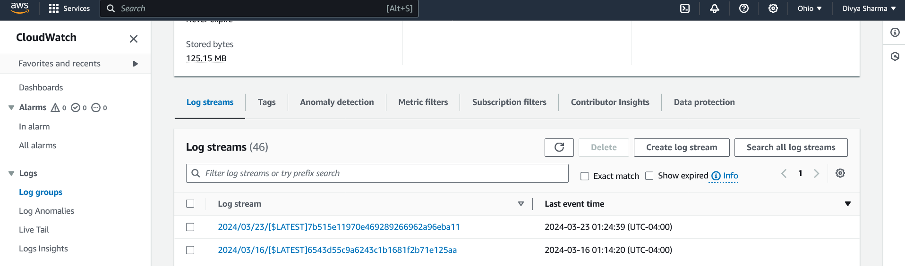

# Rust Lambda Data Processor

## Overview

This project implements an AWS Lambda function in Rust using Cargo Lambda. The Lambda function receives a JSON payload containing input "name" . It takes that input and then populates a DynamoDB database with the name, and returns the reverse of the name. The processed data can be triggered via API Gateway.

So the function would return `ayvid` if given the input `divya`

## Requirements

- Rust compiler and Cargo package manager installed.
- AWS account with permission to create Lambda functions.
- API Gateway endpoint for triggering the Lambda function.
- Enable Cloudwatch logs and X-ray tracing for the function

## Project Structure

1. **Lambda Function Code:**
   - Create a Rust project using Cargo.
   - Add dependencies for AWS Lambda and serde for JSON serialization.
   - Implement the Lambda function logic to receive three integers, process them, and return the results.
   
2. **API Gateway Integration:**
   - Configure an API Gateway endpoint to trigger the Lambda function.
   - Set up the necessary permissions and roles for the API Gateway to invoke the Lambda function.


## Setup Instructions

1. Clone the repository:

   ```
   git clone https://gitlab.com/dukeaiml/IDS721/ds655_ids721_miniproject06.git
   ```

2. Navigate to the project directory:

   ```
   cd ds655_ids721_miniproject06
   ```

3. Build the project:

   ```
   cargo build --release
   ```

The functionality for the lambda function is simple. Takes in data in JSON format for `name` and populates that in a DynamoDB database.


## Screenshots 

## Function


## Log streams



# X-Ray Tracing


-----

## License

This project is licensed under the [MIT License](LICENSE).


